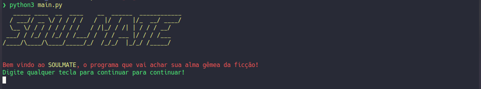
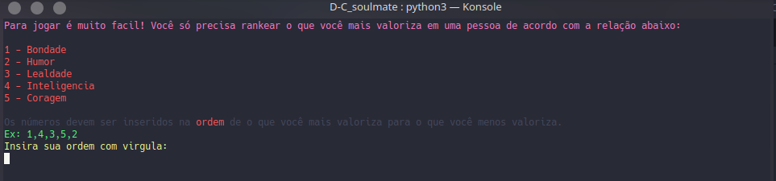
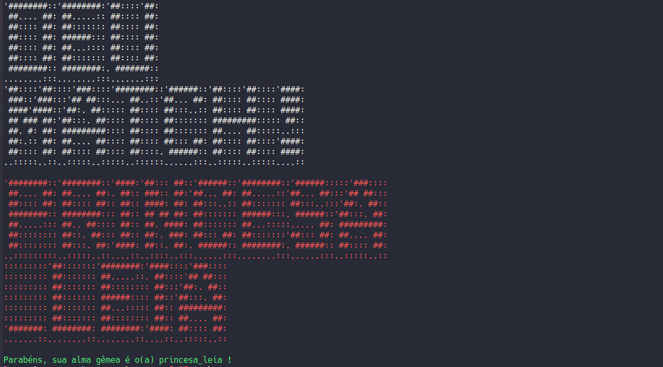

# Soulmate

**Número da Lista**: 4 
**Conteúdo da Disciplina**: Dividir para conquistar 
**Número da Dupla**: 13 

## Alunos
|Matrícula | Aluno |
| -- | -- |
| 16/0123119	 |  Guilherme de Oliveira Aguiar |
| 15/0137567  |  Lucas Siqueira Rodrigues |

## Sobre 
O projeto consiste em achar sua alma gêmea, dentre uma lista de personagens ficticios, por meio da contagem de inversões entre as virtudes mais valorizadas do usuário, e as presentes nas personalidades dos personagens, encontrando um o match ideal com o personagem com menor número de inversões.

As virtudes analisadas são:

- Bondade
- Humor
- Lealdade
- Inteligencia
- Coragem
 
## Screenshots

## Instalação 
**Linguagem**: Python3 
**Framework**: Não se aplica 

**Tecnologias**: 

- [Python](https://www.python.org/)
- [pyfiglet](https://github.com/pwaller/pyfiglet)
- [clint](https://github.com/kennethreitz-archive/clint)

Clone o repositório
> git clone https://github.com/projeto-de-algoritmos/D-C_soulmate

Acesse a pasta
> cd D-C_soulmate

Instale as dependências
> pip install -r requirements.txt

Execute o projeto
> python3 main.py

## Uso 
Ao iniciar o projeto, o usuário deve apertar "enter" para sair da tela de apresentação e prosseguir com o uso, o uso baseia-se na entrada de 5 números, que representam as virtudades a serem ranqueadas, o usuário as digita na ordem de sua preferencia exemplo: 1,3,4,2,5 e após essa entrada, o programa encontra um personagem ficticio, atráves da contagem de inversões entre as virtudes mais valorizadas do usuário, e as presentes nas personalidades dos personagens, fazendo então a apresentação do match ideal.

## Apresentação
A apresentação em video está disponível no link: https://github.com/projeto-de-algoritmos/D-C_soulmate/blob/master/Apresentacao.mp4

## Referências
- Slides do professor
- https://medium.com/@ssbothwell/counting-inversions-with-merge-sort-4d9910dc95f0
- https://codeburst.io/building-beautiful-command-line-interfaces-with-python-26c7e1bb54df?gi=524a80943f0f

